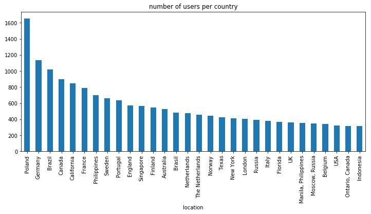

# Milestone 1

Visualization about anime information

## Datasets

1) [MyAnimeList Dataset](https://www.kaggle.com/azathoth42/myanimelist): a sizeable collection of data from all animes registered on MyAnimeList and its users

2) [Anime Recommendations Database](https://www.kaggle.com/CooperUnion/anime-recommendations-database): user scores from MyAnimeList

3) [Crunchyroll Animes Database](https://www.kaggle.com/filipefilardi/crunchyroll-anime-ratings): user scores from Crunchyroll

4) [Jikan API](https://jikan.moe/): MyAnimeList unofficial API for scrapping missing data

## Problematic

How is an anime made and how does it become popular? What is its demographic and who are the people behind its production?

Our motivation is to understand the numbers of the anime creation process and hopefully extract key insights about the works of art, but also the people that watch them and create them.

We would like to present different graphs and plots about various variables concerning anime series and films. For example, we could have :

- A clustering visualization which points would be the anime titles, and which can be reconfigured to cluster them by genre, studio, average rating, ...
- A parallel set plot that would match characters against a variable parameter such as gender, genre, voice actor, prota/antagonist
- A heatmap of users given their location, which could include other variables such as the popularity of genres.
- Some graphs about the most popular animes and their characters.
- Evolution of anime / genre / characters popularity through time.
- Some real-life insights such as cast, producers, salaries, voice acting, etc. 


## Exploratory Data Analysis

- Show some basic statistics and get insights about the data

The MyAnimeList dataset is composed of 9 csv files total. There are three main unfiltered files:

> - AnimeList.csv: a list of animes with multiple features describing them.
> - UserList.csv: a list of users.
> - UserAnimeList.csv: a list of animes for each user (SQL like).

Each of these files have a `filtered` version where only the rows that have some specific features are completed. Each of them also have a `cleaned` version where unrealistic values have been removed or corrected.



We can see above the number of users per country on the plot above. Suprinsingly, Poland is the country that is the most represented. We also see that some values don't correspond to countries but to states of america, so we will need to clean the data and group the states into USA. 


### Missing data and recovery

Many of the information displayed on MyAnimeList is not saved into the dataset: as such, we can complete the data using the aforementionned [Jikan API](https://jikan.moe/). It is an open-source REST API that scraps the MyAnimeList website, allowing anyone to obtain additional data such as characters, voice actors, images, ...

For instance, one can easily scrap the characters and their related staff given an anime identifier using:

```
https://api.jikan.moe/v3/anime/{animeID}/characters_staff
```

where `{animeID}` is the MAL anime identifier. For instance, for `animeID = 9253` we obtain a JSON object:
o
```json
"characters": [
        {
            "mal_id": 35258,
            "url": "https:\/\/myanimelist.net\/character\/35258\/Itaru_Hashida",
            "image_url": "https:\/\/cdn.myanimelist.net\/images\/characters\/6\/113767.jpg?s=5d160f99286a0891c5e32413a5438622",
            "name": "Hashida, Itaru",
            "role": "Main",
            "voice_actors": [
                {
                    "mal_id": 1,
                    "name": "Seki, Tomokazu",
                    "url": "https:\/\/myanimelist.net\/people\/1\/Tomokazu_Seki",
                    "image_url": "https:\/\/cdn.myanimelist.net\/r\/42x62\/images\/voiceactors\/1\/55486.jpg?s=23988e0eb96abf9ac6389a3f7b4b4659",
                    "language": "Japanese"
                },
                {
                    "mal_id": 19069,
                    "name": "Rinehart, Tyson",
                    "url": "https:\/\/myanimelist.net\/people\/19069\/Tyson_Rinehart",
                    "image_url": "https:\/\/cdn.myanimelist.net\/r\/42x62\/images\/voiceactors\/1\/24131.jpg?s=97e1b0b54653853270c76ea7b3c2dd92",
                    "language": "English"
                },
                ...
```

Since our dataset contains about 14000 anime titles, it seems reasonable to scrap the required information for such a number of items.

## Related work

- What others have already done with the data?

    - [anime.plus](https://anime.plus/) (aka MALGraph) allows a user to aggregate statistics such as average score, rating distribution over time, watch time per month, score per year, pie charts over genres and recommendations. However, the data is per user only.

    - [Paper on anime vizualisations.](https://www.academia.edu/5210657/AniMap_An_Interactive_Visualization_Supporting_Serendipitous_Discovery_of_Information_about_Anime) However, it is only a research paper and no implementation was done on the subject.

    - [Fandom Vizualisation](https://bunnyadvocate.tumblr.com/post/171165531592/mapping-the-anime-fandom), which contains various vizualisations about anime's fandom.

    - [Story of Anime](https://www.kaggle.com/fatihbilgin/story-of-anime), uses [MyAnimeList Dataset](https://www.kaggle.com/azathoth42/myanimelist), contains a lot of data exploration and visualizations. We believe we can showcase even more appealing visualizations

- Why is your approach original?
  
  First of all, we want to offer an interactive vizualisation, as opposed to what is already done. Then, our vizualisations will show general relationships, while having more specific components, with multiple parameters each: for instance, we want to relate the data to real-life people and demographics, geolocalizations and time. This way, we hope to extract more insights about animes, and have a better understanding about what differentiates them. We hope to generalize some trends and similarities, and bring forward the people that contribute to the production of animes, such as voice actors and directors. Finally, we will show these insights with different diagrams and chart styles and build an argument showcasing our findings.

- What source of inspiration do you take? Visualizations that you found on other websites or magazines (might be unrelated to your data).

    - The [exploring comics](https://exploringcomics.github.io/src/app/index.html) visualization from the course examples