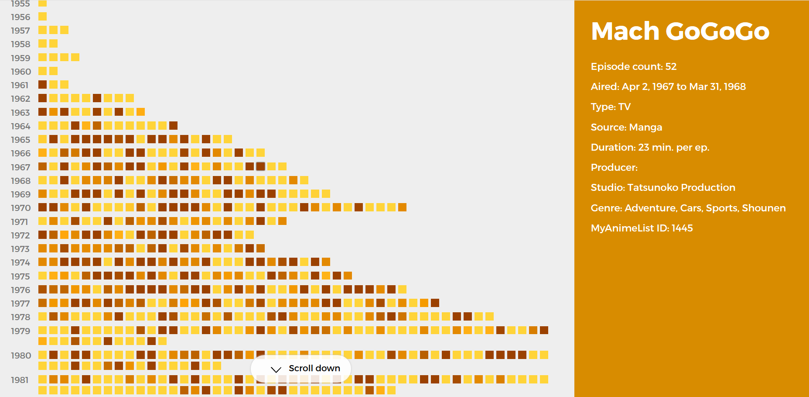
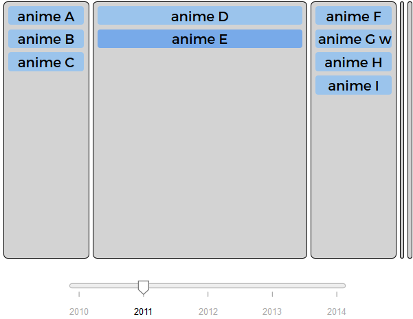
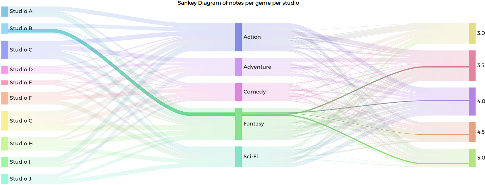
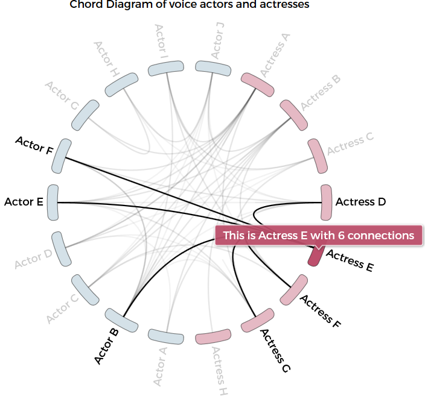

# Milestone 2

Link to the website : https://com-480-data-visualization.github.io/com-480-project-worldwideweebz/#/

## Code

- React
> The website is a react application hosted on github pages.

- d3
> Some visualizations are done with `d3.js`. Its data manipulation might be conflicting with the one of `react`. Therefore we use [react-d3-library](https://react-d3-library.github.io/) to integrate d3 visualizations in react applications.

- amcharts 4
> Other visualizations are done with `amcharts`, which is a library with a big API providing us lots of ways to modify the charts however we want in simple ways.

## Website architecture

- Pages with one graph per page
- Each page corresponds to one main visualization/mini story with a button to get the the next pages
- Smooth transitions from one page to another
- Table of content / tabs

## Graphs

The **text written in bold** corresponds to concepts that we are planning to implement for the final product, while *text written in italic* corresponds to concepts that could be nice to have for the final product.

- <ins>**History diagram :**</ins>
  - **Shows every anime/movie in a small square in a row depending on the year it**
  - **Color depending on the number of episodes in the anime**
  - **Hovering a square shows informations of the anime :**
  - *Shows image too* <- Need to be optimized
  - **Search bar to find the anime we want in the list**

- <ins>**Time diagram (done with d3):**</ins>  (*might be supressed or merged in some way with the History diagram to avoid redundancy*)
  - **horizontal slider**
  - **Showcase of the top 10 animes per year (or another time period)**
  - Each time period corresponds to either:
    - a column
    - a page
    - something else
  - how it is displayed for columns: 
    - show the selected year as 60% of the width and the ones next to it as 20%.
    - the non-selected years get compressed on the sides.
    - a mix of the two
  - *Give the possibility to choose the time period :*
    - *select between 1 month, 3 months, 6 months, 1 year, 5 years.*

- <ins>**Bubble Diagram by genre (done with d3):**</ins>
  - **Size of the bubble corresponds to :** 
    - **Number of animes in this genre**
    - *Sum of popularity of all animes within the genre* *+ interaction between that and :*
    - *Gender share*
    - *Mean/Median score*
  - **Highlighting a genre shows ~top 20 most popular anime**
  - *We can search for an anime (with autocompletion) to show it in its genres*
  - **We can search for a genre to highlight it**
  - **A small disk inside the bubble has a color representing the gender share**
  - *Selecting a genre "zooms in" into the genre and shows a bubble diagram of the top animes of the genre*

- <ins>**Sankey Diagram (done with amcharts4):**</ins>
  -  **3 columns :**
     - **1) Studio (~ ten most populars)**
     - **2) Genre (~ ten most populars)**
     - **3) Score (round to .5)**
   - **Can click on a studio to show his own Sankey proportions**
   - **Same with genre by studio**
   - *Can individually select studios and genres that show in the diagram*

  
- <ins>**Chord Diagram (done with amcharts4):**</ins>
  - **Links voice actors playing in the same anime**
  - **Highlighting one actor shows his/her personal informations**
  - *We can switch between* **different colors, depending of :**
    - **genre**
    - *label*
  - **Sort by color** *then Number of animes they dubbed in.*
  - *Different ways of showing this number :*
    - *Number inside the 'rectangle'*
    - *Lines to separate groups of same numbers*
    - *Circle arcs to separate groups of same number*

- <ins>*Interactive worldwide heatmap :*</ins>
  - **Shows popularity of specific genre over the world.**
  - *Shows popularity of specific anime over the world.*
  
- <ins>*Stacked Area Chart :*</ins>
  - Evolution of **genre** / **country** / *studio* / *anime* popularity through time.
  - **The values will be limited to the ~10 most representative**
  - *User has the option to switch into showing the popularity of the studio or country instead.*